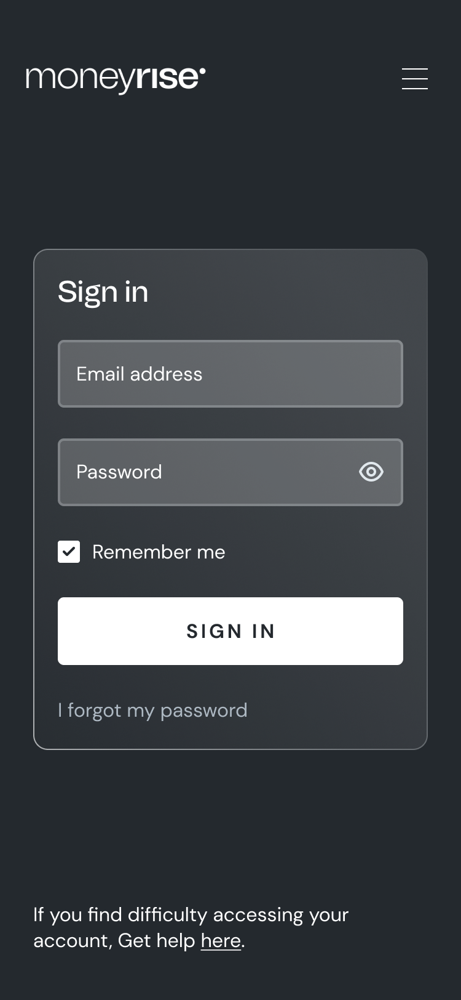

# Rise Mobile Internship Test
We just need to confirm you have what it takes. Good luck!

## Rules
* Fork this repository, so it can stay on Github
* Commit your changes after every task
* When you finish, send us the link to your repository and wait for an answer

## Prerequisites
- [Node.js](https://nodejs.org/en/)
- [yarn](https://yarnpkg.com/)
- [React Native](https://reactnative.dev/)
- [Expo](https://expo.dev/)


## Installation
Bring up a terminal, then go to your project root directory and install local dependencies:

```yarn```

To start local dev server, type in the following command in your terminal:

```yarn start```

To start the app on iOS, run:

```yarn ios```

To start the app on android, run:

```yarn android```


### Task 1
Implement the design below


### Task 2
Add validation to the login form that validates on submit.

### NOTE:

You are very much obliged to go beyond the scope of the design in a bid to handle error and success message/messages display, and any other thing that improves UX.


## Send us your repo!
After finishing all tasks, reply the mail that sent you this repo with a link to your repo.
